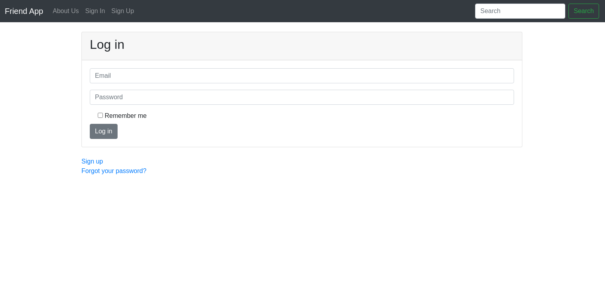

### This project is practise for rails.

#### Check for more information https://www.youtube.com/watch?v=fmyvWz5TUWg

## Built With

- Ruby on Rails

## Authors

👤 **Ahmet Bozacı**

- Github: [ahmetbozaci ](https://github.com/ahmetbozaci )
- Twitter: [ahmtbozaci](https://twitter.com/ahmtbozaci)
- Linkedin: [ahmetbozaci](https://linkedin.com/in/meron-ogbai-467414198/)

## 🤝 Contributing

Contributions, issues and feature requests are welcome!

Feel free to check the [issues page](../../issues).
